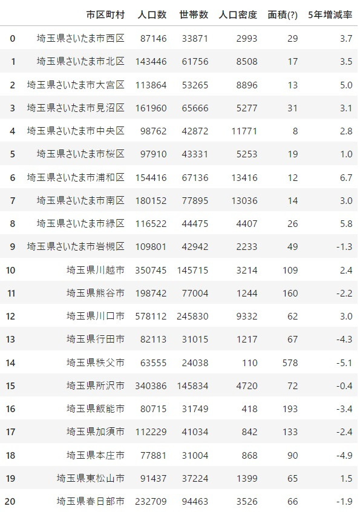
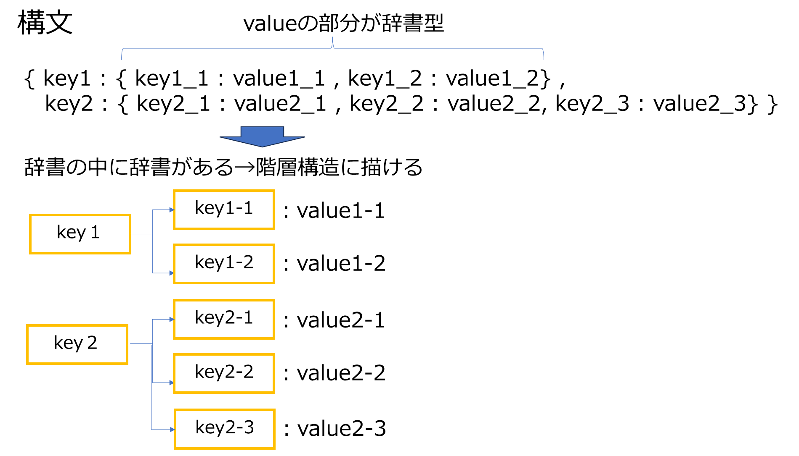
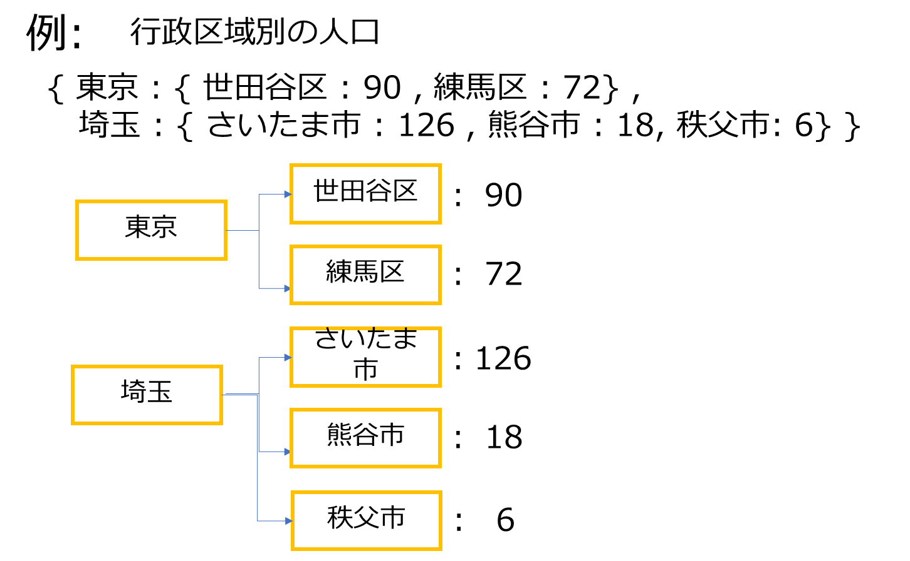

# 辞書型
- リスト型，numpy型と同じく配列型
- データは、indexの代わりにkeyと呼ばれるラベルが付与される（これが、リスト型、numpy型との違い）
- データは、keyを使って取り出す。indexは、番号だが、keyは意味が分かるようなラベルなので、データの抽出が楽になる

# 1. 辞書型の基礎
**辞書型の構文**

---
```
{ key : value, key : value, ....}  
key : データ(value)のラベル　numpy等でのindexに相当
データ(value)は、keyを使ってアクセス、取得する
valueはどのようなデータ型でもよい（混在も許容する）
```
---

例:  
```
a = {'Alice':20, 'Bob : 23, 'Maurice' : [21,'birthday'] }
``` 


```python
a = {'Alice':20, 'Bob' : 23, 'Lucy' : 10, 'Mary':23}
print(a)
# 要素を追加する
a['Frank'] = 30
print(a)
# データ(value)を書き換える（keyの重複は許容しない）
a['Bob'] = 24
print(a)
# データを取り出す
c = a['Lucy']
print(c)
# keyだけを取り出す
print(a.keys())
# データだけを取り出す
print(a.values())
print(list(a.values()))
b = {'Shohei':30, 'Mamiko' : 28}
# 辞書の連結
d = a | b
print(d)
# 要素の削除
del d['Mary']
print(d)
# 要素の数
print(len(d))
```

    {'Alice': 20, 'Bob': 23, 'Lucy': 10, 'Mary': 23}
    {'Alice': 20, 'Bob': 23, 'Lucy': 10, 'Mary': 23, 'Frank': 30}
    {'Alice': 20, 'Bob': 24, 'Lucy': 10, 'Mary': 23, 'Frank': 30}
    10
    dict_keys(['Alice', 'Bob', 'Lucy', 'Mary', 'Frank'])
    dict_values([20, 24, 10, 23, 30])
    [20, 24, 10, 23, 30]
    {'Alice': 20, 'Bob': 24, 'Lucy': 10, 'Mary': 23, 'Frank': 30, 'Shohei': 30, 'Mamiko': 28}
    {'Alice': 20, 'Bob': 24, 'Lucy': 10, 'Frank': 30, 'Shohei': 30, 'Mamiko': 28}
    6
    

## 埼玉県の統計データ



# 演習1.
1. 上表で、埼玉県川越市から埼玉県秩父市までの人口を、key:市名　value:人口　として辞書を作成せよ
2. この辞書に埼玉県所沢市の人口を追加せよ
3. 埼玉県川越市の人口を取り出せ
4. 埼玉県熊谷市の人口を190000に変更せよ
5. 上記までに作成した辞書中の人口の平均値を求めよ

 


```python


```

    {'埼玉県川越市': 350745, '埼玉県熊谷市': 198742, '埼玉県川口市': 578112, '埼玉県行田市': 82113, '埼玉県秩父市': 24038}
    {'埼玉県川越市': 350745, '埼玉県熊谷市': 198742, '埼玉県川口市': 578112, '埼玉県行田市': 82113, '埼玉県秩父市': 24038, '埼玉県所沢市': 340386}
    350745
    {'埼玉県川越市': 350745, '埼玉県熊谷市': 190000, '埼玉県川口市': 578112, '埼玉県行田市': 82113, '埼玉県秩父市': 24038, '埼玉県所沢市': 340386}
    260899.0
    

6. 上記の辞書のすべてのvalueに人口だけでなくて、世帯数も追加せよ。（人口、世帯対数を要素とするリスト型にすればよい）
8. 埼玉県行田市の世帯数を表示せよ
   


```python


```

    {'埼玉県川越市': [350745, 145715], '埼玉県熊谷市': [198742, 77004], '埼玉県川口市': [578112, 245830], '埼玉県行田市': [82113, 31015], '埼玉県秩父市': [63555, 24038], '埼玉県所沢市': [340386, 145834]}
    31015
    

# 2. 辞書型の2次元配列（階層型の辞書）
辞書のvalueがさらに辞書型になっている入れ子型の辞書







```python
population = { '東京' : { '世田谷区' : 90 , '練馬区' : 72} ,'埼玉' : { 'さいたま市' : 126 , '熊谷市' : 18, '秩父市': 6} } 
print(population)
# 千代田区　6万　所沢市　34万　を追加
population['東京']['千代田区']=6
population['埼玉']['所沢市'] = 34
print(population)
# 熊谷市の人口を取り出す
k = population['埼玉']['熊谷市']
print(k)
# 東京の人口一覧を取り出す
l = population['東京']
print(l)
```

    {'東京': {'世田谷区': 90, '練馬区': 72}, '埼玉': {'さいたま市': 126, '熊谷市': 18, '秩父市': 6}}
    {'東京': {'世田谷区': 90, '練馬区': 72, '千代田区': 6}, '埼玉': {'さいたま市': 126, '熊谷市': 18, '秩父市': 6, '所沢市': 34}}
    18
    {'世田谷区': 90, '練馬区': 72, '千代田区': 6}
    

# 演習2

1. 上表では、埼玉さいたま市のみ、区毎に人口等が表示されている。そこで、上記の辞書型pupulationから さいたま市　を削除したうえで、、  
        keyさいたま市 : value { 大宮区: 人口　...  のように、さいたま市のさらに下層に区毎の人口（単位は万人）を辞書型で追加せよ。  
    なお、対象は、西区から大宮区とする。
2.  上記1.の辞書から埼玉の人口合計を計算せよ
3.  上記1.の辞書のさいたま市について、人口と世帯数をリスト型にして更新せよ（単位は万）
                                                              


```python

```

    {'東京': {'世田谷区': 90, '練馬区': 72, '千代田区': 6}, '埼玉': {'熊谷市': 18, '秩父市': 6, '所沢市': 34, 'さいたま市': {'西区': 8, '北区': 14, '大宮区': 11}}}
    91
    [18, 6, 34, {'西区': 8, '北区': 14, '大宮区': 11}]
    [8, 14, 11]
    91
    {'東京': {'世田谷区': 90, '練馬区': 72, '千代田区': 6}, '埼玉': {'熊谷市': 18, '秩父市': 6, '所沢市': 34, 'さいたま市': {'西区': [8, 3], '北区': [14, 6], '大宮区': [11, 5]}}}
    

## 1. 上例のように、辞書のvalueが辞書型になっているような階層構造の辞書をJson(JavaScript Object Notation)と呼んでいる。
## 2. Jsonは、世界中のあらゆるデータを表現できる柔軟なデータ構造であることから、ビッグデータを表現するデータ形式の世界標準となっている


詳細は、改めて説明します。


```python

```
